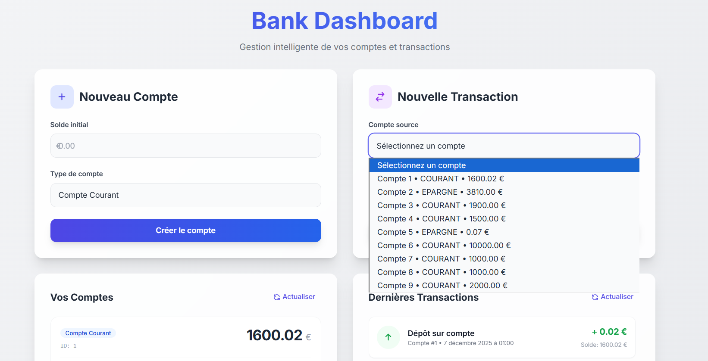
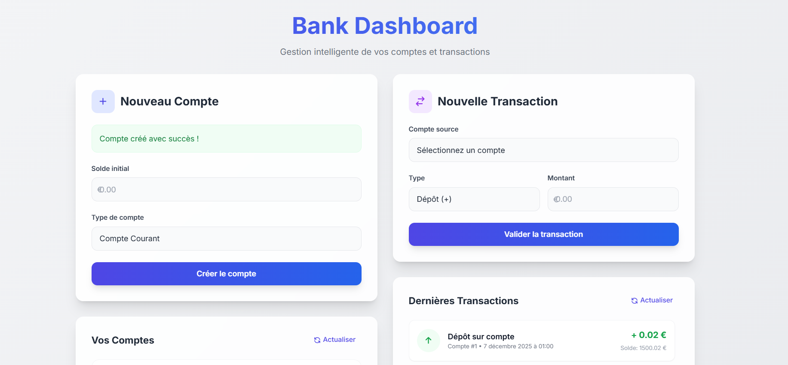
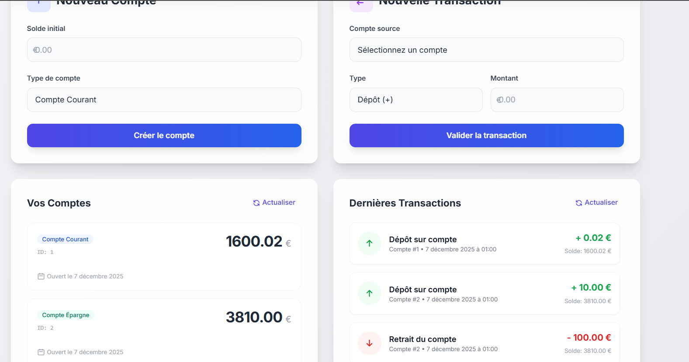

# 💰 Application de Gestion de Comptes Bancaires

Application web moderne de gestion de comptes bancaires et de transactions financières, développée avec **React**, **GraphQL** et **Apollo Client**.



---

## 📋 Table des matières

- [Présentation](#-présentation)
- [Fonctionnalités](#-fonctionnalités)
- [Technologies utilisées](#-technologies-utilisées)
- [Prérequis](#-prérequis)
- [Installation](#-installation)
- [Configuration](#️-configuration)
- [Démarrage](#-démarrage)
- [Captures d'écran](#-captures-décran)
- [Architecture du projet](#-architecture-du-projet)
- [API GraphQL](#-api-graphql)
- [Auteur](#-auteur)

---

## 🎯 Présentation

Cette application permet de gérer efficacement des comptes bancaires et leurs transactions associées. Elle offre une interface utilisateur moderne et intuitive construite avec React et Tailwind CSS, communiquant avec un backend Spring Boot via GraphQL.

### Objectifs du projet

- Démontrer l'utilisation de **GraphQL** avec Apollo Client dans une application React
- Implémenter une architecture frontend moderne avec React Hooks
- Créer une interface utilisateur responsive avec **Tailwind CSS**
- Gérer l'état de l'application avec Apollo Client Cache
- Intégrer des opérations CRUD complètes (Create, Read, Update, Delete)

---

## ✨ Fonctionnalités

### 🏦 Gestion des Comptes

- ✅ **Création de comptes** bancaires (Courant ou Épargne)
- ✅ **Affichage de la liste** de tous les comptes avec leurs détails
- ✅ **Visualisation du solde** en temps réel
- ✅ **Suppression de comptes**
- ✅ **Statistiques globales** (total des soldes, nombre de comptes, moyenne)

### 💸 Gestion des Transactions

- ✅ **Ajout de dépôts** sur les comptes
- ✅ **Effectuer des retraits** avec vérification du solde
- ✅ **Historique complet** des transactions
- ✅ **Filtrage** des transactions par compte
- ✅ **Mise à jour automatique** des soldes
- ✅ **Statistiques des transactions** (total dépôts/retraits)

### 🎨 Interface Utilisateur

- ✅ Design **moderne et responsive**
- ✅ **Code couleur** pour différencier dépôts (vert) et retraits (rouge)
- ✅ **Messages de confirmation** et gestion des erreurs
- ✅ **Actualisation en temps réel** des données
- ✅ **Validation des formulaires**

---

## 🛠 Technologies utilisées

### Frontend

| Technologie | Version | Description |
|------------|---------|-------------|
| **React** | 18.3.1 | Bibliothèque JavaScript pour construire l'interface utilisateur |
| **Apollo Client** | 3.14.0 | Client GraphQL pour React avec gestion du cache |
| **GraphQL** | 16.12.0 | Langage de requête pour les APIs |
| **Tailwind CSS** | 3.4.18 | Framework CSS utilitaire pour le styling |
| **React Scripts** | 5.0.1 | Scripts de configuration pour Create React App |

### Backend (requis)

| Technologie | Version | Description |
|------------|---------|-------------|
| **Spring Boot** | 3.2.0 | Framework backend Java |
| **Spring GraphQL** | 1.2.4 | Support GraphQL pour Spring |
| **H2 Database** | - | Base de données en mémoire |
| **JPA/Hibernate** | - | ORM pour la persistance des données |

---

## 📦 Prérequis

Avant de commencer, assurez-vous d'avoir installé :

- **Node.js** : version 16 ou supérieure
  ```bash
  node --version  # Devrait afficher v16.x.x ou plus
  ```

- **npm** : version 7 ou supérieure
  ```bash
  npm --version   # Devrait afficher 7.x.x ou plus
  ```

- **Java** : JDK 17 ou supérieure (pour le backend)
  ```bash
  java --version  # Devrait afficher Java 17 ou plus
  ```

- **Maven** : version 3.6 ou supérieure (pour le backend)
  ```bash
  mvn --version   # Devrait afficher Maven 3.6.x ou plus
  ```

---

## 📥 Installation

### 1. Cloner le projet

```bash
git clone <url-du-repo>
cd Projet-React-avec-GraphQL-et-Apollo-Client/gestion-comptes
```

### 2. Installer les dépendances

```bash
npm install
```

Cette commande va installer :
- React et React DOM
- Apollo Client et GraphQL
- Tailwind CSS et ses dépendances
- Toutes les autres bibliothèques nécessaires

### 3. Vérifier l'installation

```bash
npm list --depth=0
```

Vous devriez voir toutes les dépendances listées sans erreurs.

---

## ⚙️ Configuration

### Configuration du proxy

Le fichier `package.json` contient la configuration du proxy pour rediriger les requêtes GraphQL vers le backend :

```json
{
  "proxy": "http://localhost:8082"
}
```

**Note :** Assurez-vous que votre backend Spring Boot tourne sur le port **8082**.

### Configuration d'Apollo Client

Le fichier `src/apollo/client.js` configure Apollo Client :

```javascript
import { ApolloClient, InMemoryCache, createHttpLink } from '@apollo/client';

const httpLink = createHttpLink({
  uri: '/graphql',              // Endpoint GraphQL
  credentials: 'include',       // Inclure les credentials
});

export const client = new ApolloClient({
  link: httpLink,
  cache: new InMemoryCache(),   // Cache en mémoire
  defaultOptions: {
    watchQuery: {
      fetchPolicy: 'network-only', // Toujours récupérer les données fraîches
    },
    query: {
      fetchPolicy: 'network-only',
    },
  },
});
```

### Configuration de Tailwind CSS

Le fichier `tailwind.config.js` configure les chemins des fichiers à scanner :

```javascript
module.exports = {
  content: [
    "./src/**/*.{js,jsx,ts,tsx}",
  ],
  theme: {
    extend: {},
  },
  plugins: [],
}
```

---

## 🚀 Démarrage

### Étape 1 : Démarrer le backend Spring Boot

Dans un premier terminal, démarrez le backend :

```bash
cd ../TP-Service-GraphQL-avec-Spring-Boot/graph
mvn spring-boot:run
```

Attendez que le message suivant apparaisse :
```
Started GraphApplication in X.XXX seconds
```

Le backend sera accessible sur : `http://localhost:8082`
- API GraphQL : `http://localhost:8082/graphql`
- Console H2 : `http://localhost:8082/h2-console`

### Étape 2 : Démarrer l'application React

Dans un second terminal, depuis le dossier `gestion-comptes` :

```bash
npm start
```

L'application s'ouvrira automatiquement dans votre navigateur sur : `http://localhost:3000`

Si elle ne s'ouvre pas automatiquement, ouvrez manuellement cette URL.

---

## 📸 Captures d'écran

### Liste et sélection des comptes


*Vue d'ensemble de l'application montrant la liste de tous les comptes avec leurs détails (ID, type, solde, date de création)*

### Création d'un compte


*Formulaire de création d'un nouveau compte bancaire (Courant ou Épargne) avec saisie du solde initial*

### Ajout d'une transaction


*Formulaire pour ajouter un dépôt ou un retrait sur un compte sélectionné*

### Ajout d'une transaction - Vue alternative


*Autre vue du formulaire de transaction montrant la sélection du compte et du type d'opération*

---

## 🏗 Architecture du projet

```
gestion-comptes/
├── public/                      # Fichiers publics
│   ├── index.html              # Point d'entrée HTML
│   └── favicon.ico             # Icône de l'application
│
├── src/
│   ├── apollo/                 # Configuration Apollo Client
│   │   └── client.js           # Configuration du client GraphQL
│   │
│   ├── components/             # Composants React
│   │   ├── CompteList.js       # Liste des comptes
│   │   ├── CreateCompte.js     # Formulaire de création de compte
│   │   ├── TransactionForm.js  # Formulaire d'ajout de transaction
│   │   └── TransactionList.js  # Liste des transactions
│   │
│   ├── graphql/                # Définitions GraphQL
│   │   ├── mutations.js        # Mutations (create, update, delete)
│   │   ├── queries.js          # Requêtes (read)
│   │   ├── types.js            # Énumérations TypeScript
│   │   └── interfaces.js       # Interfaces TypeScript
│   │
│   ├── utils/                  # Utilitaires
│   │   └── dateFormatter.js    # Fonctions de formatage des dates
│   │
│   ├── App.js                  # Composant principal
│   ├── App.css                 # Styles de l'application
│   ├── index.js                # Point d'entrée React
│   └── index.css               # Styles globaux + Tailwind
│
├── Screen/                     # Captures d'écran
│   ├── selct-cmpt.png         # Liste des comptes
│   ├── crerer-cmpt.png        # Création de compte
│   ├── ajoute-trans.png       # Ajout de transaction
│   └── ajoute-trans2.png      # Transaction alternative
│
├── package.json                # Dépendances et scripts
├── tailwind.config.js          # Configuration Tailwind CSS
├── postcss.config.js           # Configuration PostCSS
└── README.md                   # Documentation (ce fichier)
```

---

## 🔌 API GraphQL

### Queries (Requêtes)

#### Récupérer tous les comptes
```graphql
query GetAllComptes {
  allComptes {
    id
    solde
    dateCreation
    type
  }
}
```

#### Récupérer un compte par ID
```graphql
query GetCompteById($id: ID!) {
  compteById(id: $id) {
    id
    solde
    dateCreation
    type
  }
}
```

#### Récupérer toutes les transactions
```graphql
query GetAllTransactions {
  allTransactions {
    id
    type
    montant
    date
    compte {
      id
      solde
      type
    }
  }
}
```

#### Récupérer les transactions d'un compte
```graphql
query GetCompteTransactions($id: ID!) {
  compteTransactions(id: $id) {
    id
    type
    montant
    date
  }
}
```

#### Statistiques des comptes
```graphql
query GetTotalSolde {
  totalSolde {
    count
    sum
    average
  }
}
```

#### Statistiques des transactions
```graphql
query GetTransactionStats {
  transactionStats {
    count
    sumDepots
    sumRetraits
  }
}
```

### Mutations (Modifications)

#### Créer un compte
```graphql
mutation SaveCompte($compte: CompteRequest!) {
  saveCompte(compte: $compte) {
    id
    solde
    dateCreation
    type
  }
}
```

Variables :
```json
{
  "compte": {
    "solde": 1000.0,
    "type": "COURANT"
  }
}
```

#### Supprimer un compte
```graphql
mutation DeleteCompte($id: ID!) {
  deleteCompte(id: $id)
}
```

#### Ajouter une transaction
```graphql
mutation AddTransaction($transactionRequest: TransactionRequest!) {
  addTransaction(transactionRequest: $transactionRequest) {
    id
    type
    montant
    date
    compte {
      id
      solde
      type
    }
  }
}
```

Variables :
```json
{
  "transactionRequest": {
    "type": "DEPOT",
    "montant": 500.0,
    "compteId": "1"
  }
}
```

### Types

#### TypeCompte
```graphql
enum TypeCompte {
  COURANT
  EPARGNE
}
```

#### TypeTransaction
```graphql
enum TypeTransaction {
  DEPOT
  RETRAIT
}
```

---

## 🧪 Tests

### Tester l'application manuellement

1. **Créer un compte** :
   - Remplir le formulaire de création
   - Vérifier qu'il apparaît dans la liste

2. **Ajouter un dépôt** :
   - Sélectionner un compte
   - Choisir "Dépôt"
   - Entrer un montant
   - Vérifier que le solde est mis à jour

3. **Effectuer un retrait** :
   - Sélectionner un compte
   - Choisir "Retrait"
   - Entrer un montant inférieur au solde
   - Vérifier que le solde diminue

4. **Tester la validation** :
   - Essayer un retrait supérieur au solde
   - Vérifier le message d'erreur

5. **Vérifier l'actualisation** :
   - Cliquer sur "Actualiser"
   - Vérifier que les données sont à jour

---

## 🐛 Dépannage

### Le backend ne démarre pas
- Vérifiez que le port 8082 est libre : `lsof -i :8082`
- Vérifiez que Java 17+ est installé : `java --version`
- Consultez les logs pour identifier l'erreur

### L'application React ne se connecte pas au backend
- Vérifiez que le backend est démarré sur le port 8082
- Vérifiez la configuration du proxy dans `package.json`
- Consultez la console du navigateur (F12) pour voir les erreurs

### Les dates s'affichent mal
- Les fonctions de formatage dans `utils/dateFormatter.js` gèrent automatiquement les différents formats
- Si problème persistant, vérifiez que le backend renvoie les dates au bon format

### Erreurs de compilation Tailwind CSS
- Vérifiez que `tailwind.config.js` et `postcss.config.js` sont présents
- Redémarrez le serveur de développement : `npm start`

---

## 📚 Ressources

- [Documentation React](https://react.dev/)
- [Documentation Apollo Client](https://www.apollographql.com/docs/react/)
- [Documentation GraphQL](https://graphql.org/learn/)
- [Documentation Tailwind CSS](https://tailwindcss.com/docs)
- [Documentation Spring GraphQL](https://docs.spring.io/spring-graphql/docs/current/reference/html/)

---

## 👨‍💻 Auteur

**Abderrahim Boussyf**


- Projet : TP GraphQL avec React et Spring Boot
- Date : 2024-2025

---

## 📄 Licence

Ce projet est réalisé dans un cadre pédagogique.

## Author
salaheks